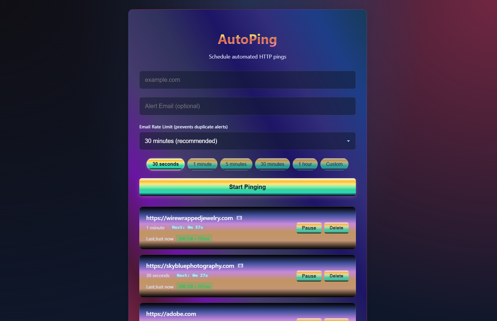

# AutoPing

AutoPing is a simple, premium web application that allows you to schedule automated HTTP pings to any URL at defined intervals.



## Features
- **Dashboard**: A beautiful, dark-mode interface with glassmorphism design.
- **Scheduler**: Reliable backend scheduling using `node-cron`.
- **Persistence**: Jobs are saved in a local SQLite database.
- **Real-time**: The dashboard updates automatically.
- **Email Notifications**: Smart failure detection with automatic email alerts and recovery notifications.
- **Desktop Notifications**: Windows toast notifications when alerts are sent.
- **Intelligent Recovery**: Rapid verification mode and automatic recovery detection with email notifications.
- **Per-Job Rate Limiting**: Configure email rate limits (5, 15, 30, or 60 minutes) for each monitoring job.
- **State Management**: Visual indicators for monitoring states (Normal, Rapid Check, Paused).
- **Automatic Safeguards**: Permanent pause after 5 failure cycles prevents endless monitoring of dead domains.

## Tech Stack
- **Frontend**: React, Vite, Vanilla CSS (Premium Dark Mode)
- **Backend**: Node.js, Express
- **Database**: SQLite
- **Scheduler**: node-cron

## Getting Started

### Prerequisites
- Node.js installed on your machine.

### Quick Start
Simply run the startup script in the root directory:
```powershell
.\start.ps1
```
This will open two new terminal windows: one for the server and one for the client.

### Manual Start
If you prefer to start them manually:

**1. Backend**
```bash
cd server
npm install # First time only
npm start
```

**2. Frontend**
```bash
cd client
npm install # First time only
npm run dev
```

Open [http://localhost:5173](http://localhost:5173) to view the dashboard.

## Email Notifications Setup

AutoPing includes intelligent email notifications for domain downtime monitoring.

### Quick Setup

1. **Configure SMTP Settings**
   - Copy `server/.env.example` to `server/.env`
   - Update with your SMTP credentials (Gmail, Outlook, SendGrid, etc.)

2. **Add Alert Email to Jobs**
   - When creating a monitoring job, enter your alert email address
   - The 📧 badge will appear next to jobs with email alerts configured

### How It Works

AutoPing uses a smart 3-state system to detect and notify you of failures:

1. **Normal State** → Regular monitoring at your configured interval
2. **First Failure Detected** → Switches to 15-second rapid checks
3. **3 Consecutive Failures** → Sends email alert + Windows toast notification, then pauses for 5 minutes
4. **Auto-Recovery** → When domain recovers, sends recovery email notification and returns to normal monitoring
5. **Permanent Pause** → After 5 failure cycles, requires manual reset to prevent endless monitoring

**See [EMAIL_NOTIFICATIONS.md](EMAIL_NOTIFICATIONS.md) for complete setup guide and documentation.**

### Example SMTP Configuration (Gmail)

```env
SMTP_HOST=smtp.gmail.com
SMTP_PORT=587
SMTP_SECURE=false
SMTP_USER=your-email@gmail.com
SMTP_PASS=your-app-password
EMAIL_FROM=AutoPing <your-email@gmail.com>
```

**Note:** For Gmail, you need to create an [App Password](https://support.google.com/accounts/answer/185833) instead of using your regular password.
